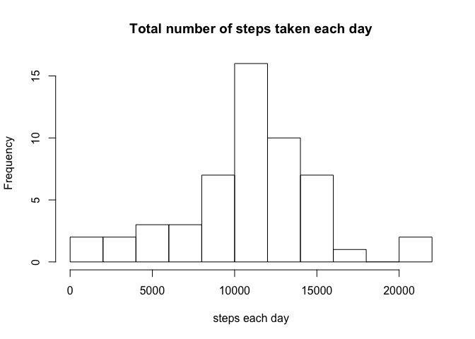
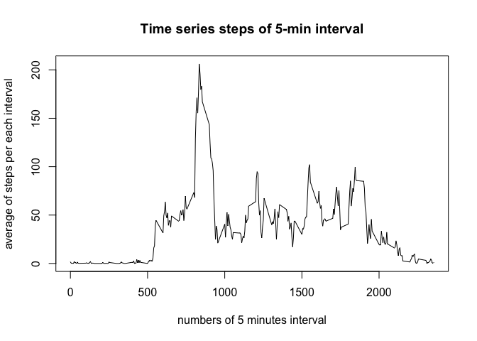
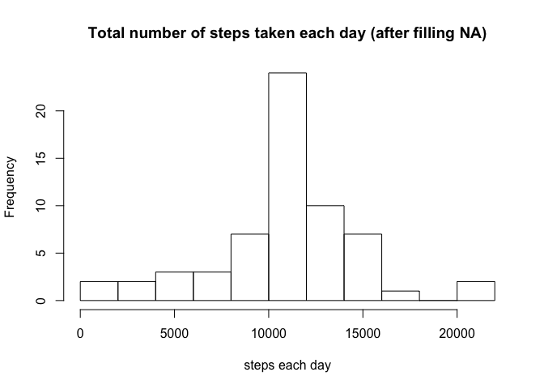
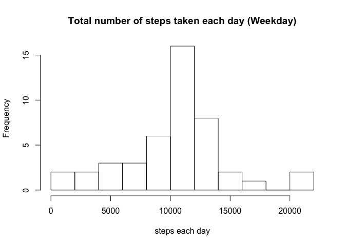
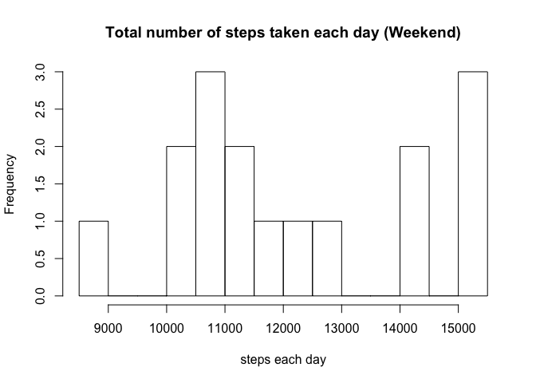
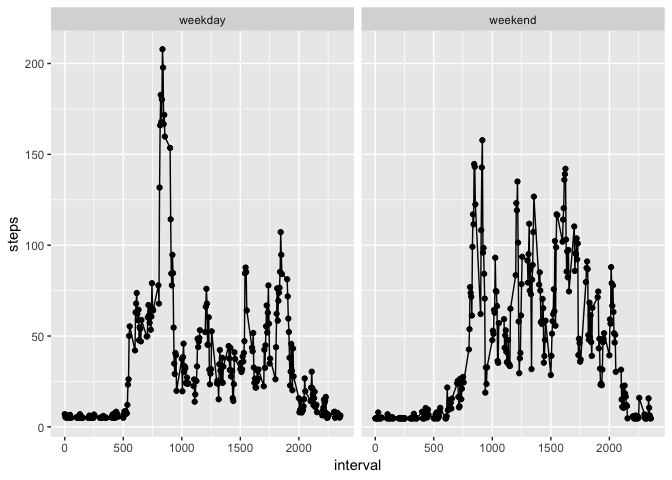

## Loading and preprocessing the data

1. Load the data

```r
activity <- read.csv("./activity.csv")
```


## What is mean total number of steps taken per day?

2. Calculate the total number of steps taken per day

```r
steps_day <- with(activity, tapply(steps, date, sum))
```

3. Make a histogram of the total number of steps taken each day

```r
hist(steps_day, breaks=10, main="Total number of steps taken each day", xlab="steps each day")
```

<!-- -->

4. Calculate and report the mean and median of the total number of steps taken per day

```r
summary(steps_day)
```

```
##    Min. 1st Qu.  Median    Mean 3rd Qu.    Max.    NA's 
##      41    8841   10765   10766   13294   21194       8
```

## What is the average daily activity pattern?

5. Make a time series plot of the 5-minute interval and the average number of steps taken

```r
steps_ave <- aggregate(steps ~  + interval, activity, mean)
plot(steps_ave$interval, steps_ave$steps, type="l", xlab="numbers of 5 minutes interval", ylab="average of steps per each interval", main="Time series steps of 5-min interval")
```

<!-- -->

6. Which 5-minute interval, on average across all the days in the dataset, contains the maximum number of steps?

```r
steps_ave[steps_ave$steps == max(steps_ave$steps),]
```

```
##     interval    steps
## 104      835 206.1698
```


##Imputing missing values

7. Calculate and report the total number of missing values in the dataset

```r
summary(activity)
```

```
##      steps                date          interval     
##  Min.   :  0.00   2012-10-01:  288   Min.   :   0.0  
##  1st Qu.:  0.00   2012-10-02:  288   1st Qu.: 588.8  
##  Median :  0.00   2012-10-03:  288   Median :1177.5  
##  Mean   : 37.38   2012-10-04:  288   Mean   :1177.5  
##  3rd Qu.: 12.00   2012-10-05:  288   3rd Qu.:1766.2  
##  Max.   :806.00   2012-10-06:  288   Max.   :2355.0  
##  NA's   :2304     (Other)   :15840
```

8. Create a new dataset that is equal to the original dataset but with the missing data filled in.

```r
activity2 <- activity
activity2$steps[is.na(activity2$steps)]<-mean(steps_ave$steps)  #replace NA with the mean steps of each interval
```

9. Make a histogram of the total number of steps taken each day after filling NA

```r
steps_day2 <- with(activity2, tapply(steps, date, sum))
hist(steps_day2, breaks=10, main="Total number of steps taken each day (after filling NA)", xlab="steps each day")
```

<!-- -->

10. Calculate and report the mean and median total number of steps taken per day. 

```r
summary(steps_day2)
```

```
##    Min. 1st Qu.  Median    Mean 3rd Qu.    Max. 
##      41    9819   10766   10766   12811   21194
```


## Are there differences in activity patterns between weekdays and weekends?

11. Create a new factor variable in the dataset with two levels ??? ???weekday??? and ???weekend??? indicating whether a given date is a weekday or weekend day

```r
activity2$week <- weekdays(as.Date(activity2$date))
activity_Mon <- subset(activity2, activity2$week == "Monday")
activity_Tue <- subset(activity2, activity2$week == "Tuesday")
activity_Wed <- subset(activity2, activity2$week == "Wednesday")
activity_Thr <- subset(activity2, activity2$week == "Thursday")
activity_Fri <- subset(activity2, activity2$week == "Friday")
activity_Sat <- subset(activity2, activity2$week == "Saturday")
activity_Sun <- subset(activity2, activity2$week == "Sunday")
activity_weekday <- rbind(activity_Mon, activity_Tue, activity_Wed, activity_Thr, activity_Fri)
activity_weekend <- rbind(activity_Sat, activity_Sun)
activity_weekday$weektype <- "weekday"
activity_weekend$weektype <- "weekend"
activity3 <- rbind(activity_weekday, activity_weekend)
```

12. Make a histogram of the total number of steps taken for weekday and weekend

```r
steps_weekday <- with(activity_weekday, tapply(steps, date, sum))
steps_weekend <- with(activity_weekend, tapply(steps, date, sum))
hist(steps_weekday, breaks=10, main="Total number of steps taken each day (Weekday)", xlab="steps each day")
```

<!-- -->

```r
hist(steps_weekend, breaks=10, main="Total number of steps taken each day (Weekend)", xlab="steps each day")
```

<!-- -->

13. Make a panel plot containing a time series plot of the 5-minute interval (x-axis) and the average number of steps taken, averaged across all weekday days or weekend days (y-axis).

```r
steps_week_ave <- aggregate(steps ~  interval + weektype , activity3, mean)
library(ggplot2) # loads the library ggplot2
qplot(interval, steps, data=steps_week_ave, facets=.~weektype) + geom_line()
```

<!-- -->
